# Laravel-Drupal-Project

## Event Management System - Laravel 12 
 
### Laravel Pages

#### Welcome Page
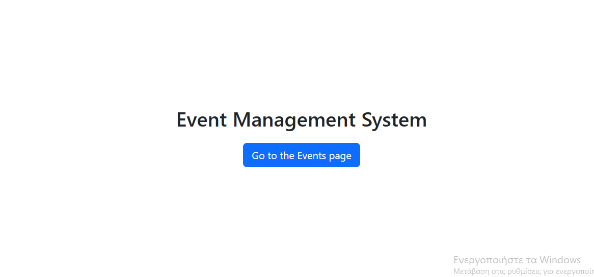

#### Events Page
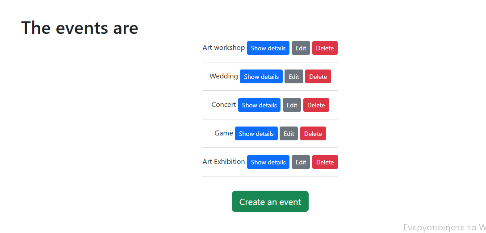

#### Create an Event Page
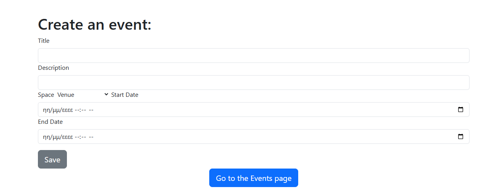

#### Show an Event Page
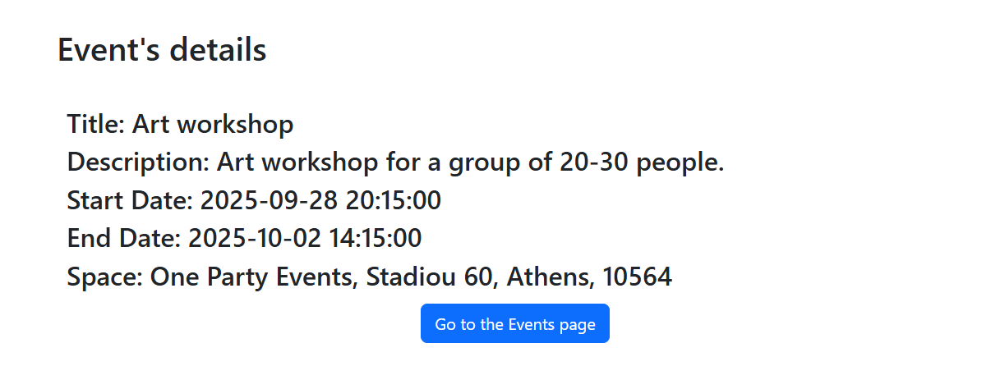

#### Edit an Event Page
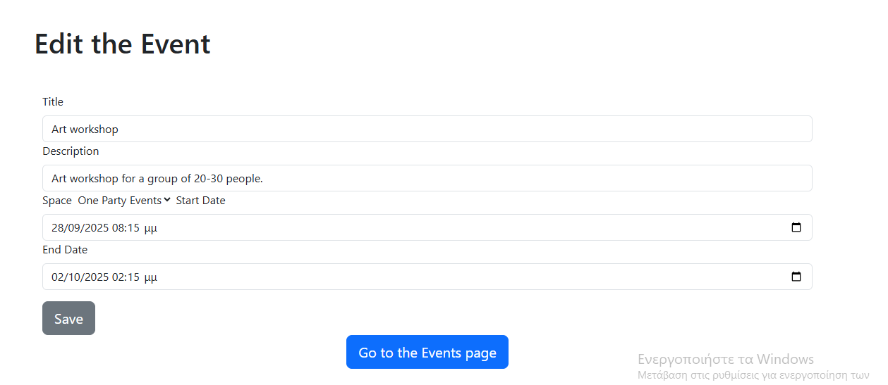

#### Delete an Event Page
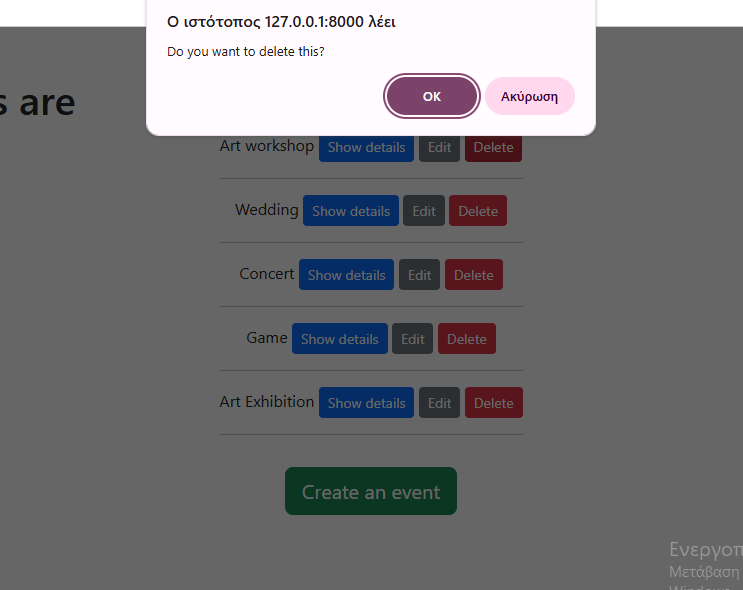

## News and Events Portal - Drupal 

### Drupal Project - Part 1

#### Installation Instructions

#### Content Type / Vocabulary / Views

##### Create a content type:
Structure -> Content Types -> Add Content Type -> Article -> Save

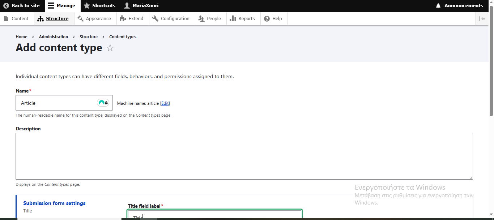

##### Field managing:

Structure -> Content types -> Article -> Edit 

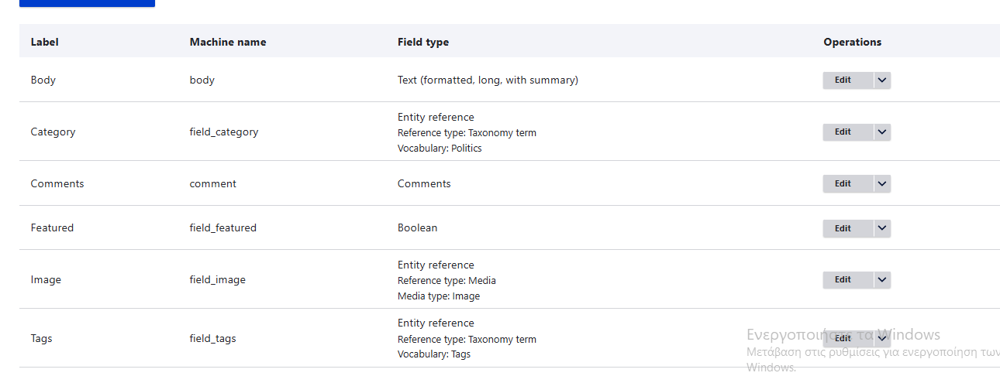

##### Create vocabulary:

Structure -> Taxonomy -> Add Vocabulary

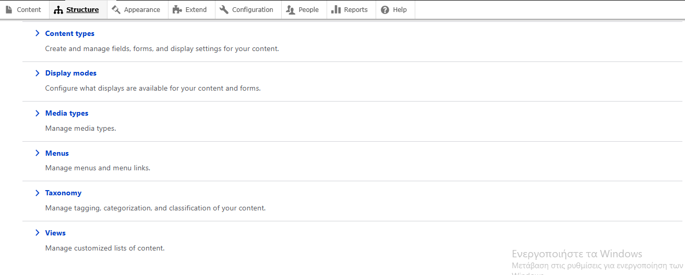
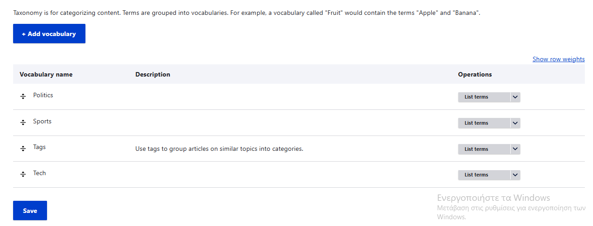

##### Create Views

Structue -> Views -> Add View 

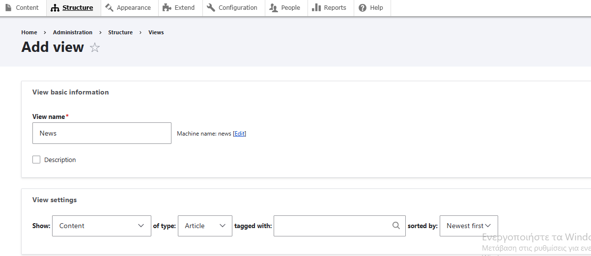
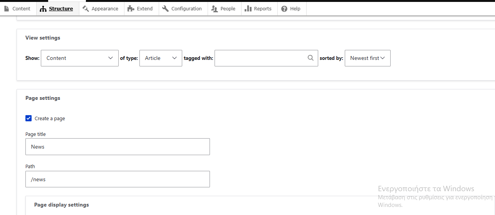
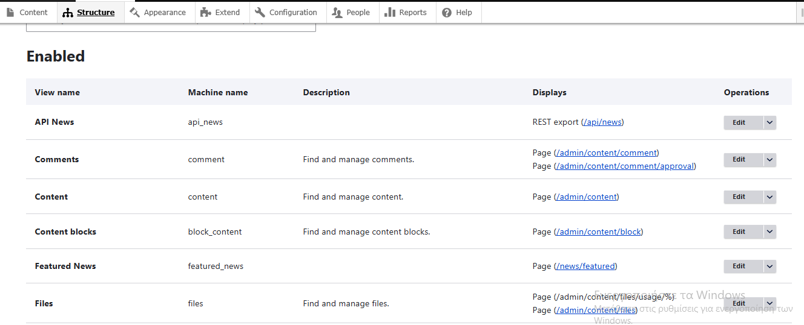
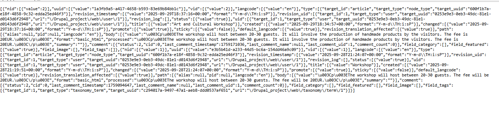
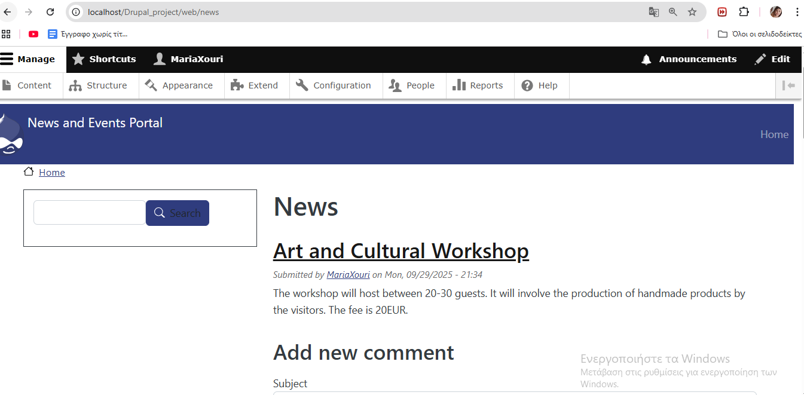

### Drupal Project - Part 2

Front-News Page (/front-news)

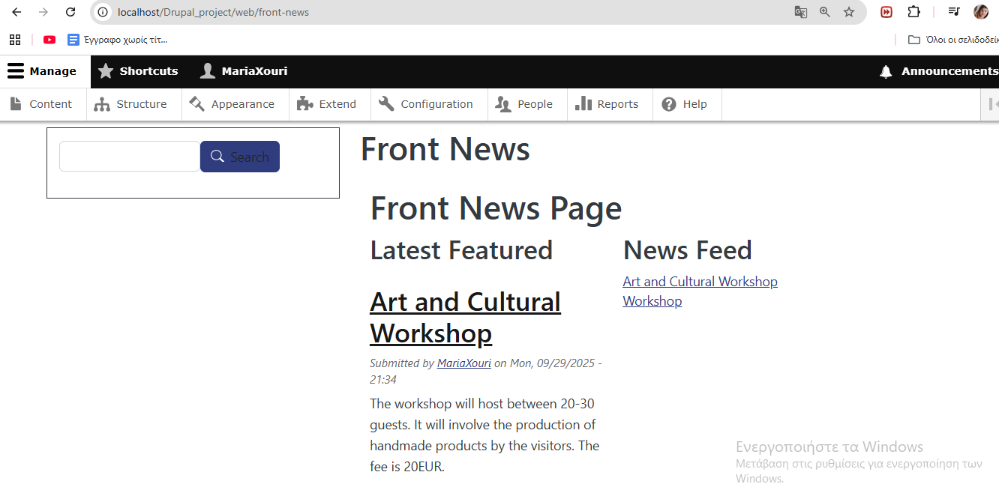

### Drupal Custom Model Creation

Upcoming Events display 

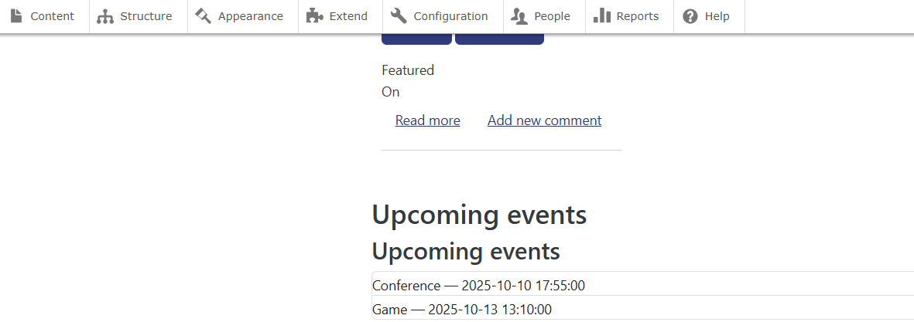

