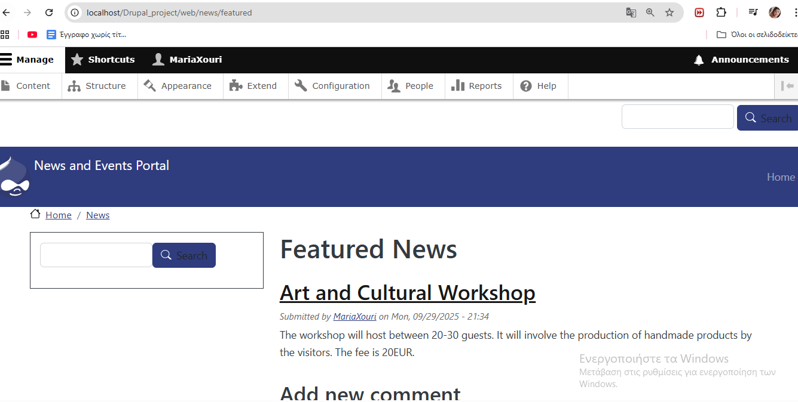

# Laravel-Drupal-Project

## Event Management System - Laravel 12 
 
### Laravel Pages

#### Welcome Page

#### Events Page

#### Create an Event Page

#### Show an Event Page

#### Edit an Event Page

#### Delete an Event Page

## News and Events Portal - Drupal 

### Drupal Project - Part 1

#### Installation Instructions

#### Content Type / Vocabulary / Views

##### Create a content type:
Structure -> Content Types -> Add Content Type -> Article -> Save

##### Field managing:

Structure -> Content types -> Article -> Edit 

##### Create vocabulary:

Structure -> Taxonomy -> Add Vocabulary

##### Create Views

Structue -> Views -> Add View 

### Drupal Project - Part 2

Front-News Page (/front-news)

### Drupal Custom Model Creation

Upcoming Events display 

